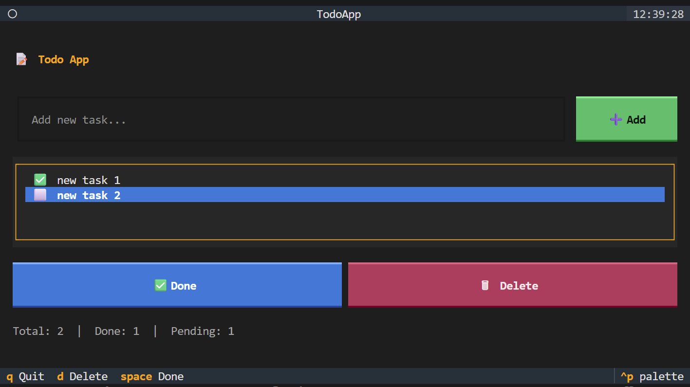

# Todo App

A terminal-based Todo application with a rich UI, built with Python and [Textual](https://textual.textualize.io/).

This project was built as a hands-on way to learn the Textual framework — exploring widgets, layouts, event handling, and reactive styling in a real application.



## Setup

```bash
pip install -r requirements.txt
python todo_app.py
```

## Features

- Add, complete, and delete tasks
- Tasks are saved to `todos.json` and persist between sessions
- Keyboard-driven interface

## Keyboard Shortcuts

| Key     | Action       |
|---------|--------------|
| `Enter` | Add task     |
| `Space` | Toggle done  |
| `D`     | Delete task  |
| `Q`     | Quit         |

## What I Learned

- Structuring a Textual app with `App`, `compose()`, and `on_mount()`
- Building layouts with `Vertical` and `Horizontal` containers
- Handling events with `@on` decorators
- Updating widgets directly (vs. full recompose)
- Persisting state with JSON
